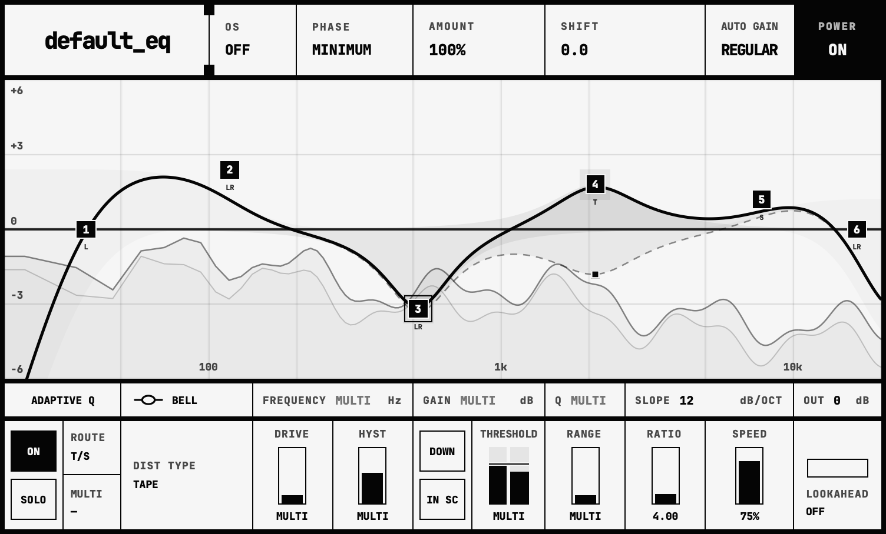

# default_eq



**default_eq** is designed to be your go-to EQ for tonal shaping, dynamic control, and adding harmonic character exactly where you need it.

Built around eight fully independent bands, it combines parametric and dynamic
EQ, per-band saturation, Linear Phase processing, two Auto Gain modes,
L/R, M/S and transient/sustain routing, and a real-time spectrum analyzer in a
compact interface.

Most editing happens directly on the analyzer:

- **Click empty space** to create a filter: Bell in the middle, Low Shelf in
  the upper left, High Shelf in the upper right, High Cut in the lower left,
  or Low Cut in the lower right.
- **Shift-click empty space** to create Tilt, except in the lower far-left and
  far-right areas, which create resonant High Cut and Low Cut respectively.
  Keep the mouse button held to immediately drag any newly created filter.
- **Cmd-drag** a band to adjust Drive; **Shift-drag** it to adjust the dynamic
  Threshold.
- Use the **mouse wheel** for Q (or Slope on non-resonant Cut filters),
  **Shift-wheel** for placement, **Cmd/Ctrl-wheel** for Slope, and **Alt-wheel**
  for Character. Scrolling up increases Slope; scrolling down decreases it.
- **Shift-click** individual bands to add or remove them from the selection.
  **Right-drag** a marquee over empty graph space to select
  multiple bands.
- **Alt-click** a band to momentarily solo it; **Cmd-click** toggles bypass.
- **Right-click** a band to choose its filter, L/R–M/S–T/S placement,
  saturation mode, or reset the equalizer. **Double-click** a band to delete it.
- **Shift-Cmd-click** a band to reset its placement. **Alt-right-click** resets
  its Slope; **Cmd-right-click** resets its Drive and Character.
- For precise adjustments, **Freq, Gain, Q, and Slope** can also be entered via double-click
  directly in the parameter fields below. 

In the logo settings panel, **RTA AVERAGE** controls averaging for the analyzer
and all Spectral Statistics. Tonal Balance retains its relative scale, independent
of **RTA SLOPE**, **RTA FLOOR**, and **RTA CEILING**. Ceiling defaults to 0 dB
and adjusts from −24 to +24 dB; drag or scroll its value, or right-click to reset it.

There is deliberately no internal preset system. Plugin state is handled
through the host, with complete project recall, versioned state, and Undo/Redo
support.

## Thanks and third-party code

- [FreeEQ8](https://github.com/GareBear99/FreeEQ8) by GareBear99, the GPLv3
  codebase from which `default_eq` was originally forked. Modified portions
  remain in the processor lifecycle, parameter/state scaffolding, band engine,
  spectrum transport, and Linear Phase infrastructure.
- [ZLEqualizer](https://github.com/ZL-Audio/ZLEqualizer) by ZL-Audio, providing
  AGPLv3 filter design and analyzer architecture.
- [ZLSplitter](https://github.com/ZL-Audio/ZLSplitter) by ZL-Audio, providing
  AGPLv3 transient/sustain separation.

Exact repositories, revisions, licences, modifications, and code boundaries
are documented in [`THIRD_PARTY_NOTICES.md`](THIRD_PARTY_NOTICES.md). Included
license texts are in [`LICENSES/`](LICENSES/).

## Installation

Each binary release includes a platform-specific install script. Double-click
`Install.command` on macOS, `Install.cmd` on Windows, or `Install.sh` on Linux.
The scripts install the plug-in formats into the current user's standard
folders without requiring administrator access.

## Build

```sh
git submodule update --init --recursive

cmake -S . -B build -G "Unix Makefiles" \
  -DCMAKE_BUILD_TYPE=Release \
  -DDEFAULT_EQ_BUILD_TESTS=ON \
  -DCMAKE_OSX_ARCHITECTURES="arm64;x86_64"

cmake --build build --config Release -j 8
ctest --test-dir build --output-on-failure
```

On Windows and Linux, omit `CMAKE_OSX_ARCHITECTURES`. AU is built only on
macOS. Builds stay inside the build directory by default. Pass
`-DDEFAULT_EQ_COPY_PLUGIN_AFTER_BUILD=ON` only when the built plug-ins should
replace the copies in the user's standard plug-in folders.

The current implementation contract and 0.5.3 verification record are documented
in [`docs/implementation-status.md`](docs/implementation-status.md) and
[`docs/verification-0.5.3.md`](docs/verification-0.5.3.md). Earlier release
records remain in [`docs/verification-0.5.2.md`](docs/verification-0.5.2.md),
[`docs/verification-0.5.1.md`](docs/verification-0.5.1.md),
[`docs/verification-0.5.0.md`](docs/verification-0.5.0.md), and
[`docs/verification-0.4.0.md`](docs/verification-0.4.0.md).

## Licence

**default_eq** is open source under `AGPL-3.0-only`.

FreeEQ8-derived portions retain their `GPL-3.0-only` notices and are combined
with the project under GPLv3 section 13.

See [`LICENSE.md`](LICENSE.md), [`LICENSES/`](LICENSES/), and
[`THIRD_PARTY_NOTICES.md`](THIRD_PARTY_NOTICES.md).

Copyright (C) 2026 icanseesounds and upstream copyright holders.
