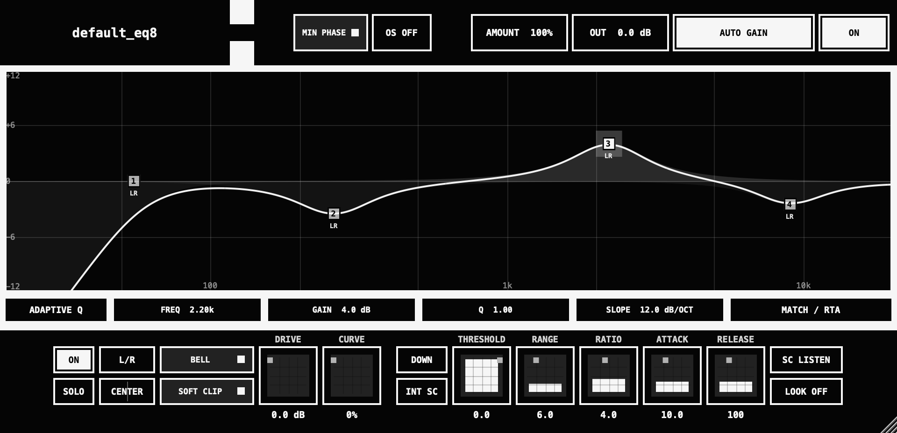

# default_eq8



**default_eq8** is an open-source eight-band parametric dynamic EQ for
sculpting, balancing, and dynamically controlling audio. It combines per-band
saturation, two Auto Gain modes, optional Linear Phase processing, and a
real-time analyzer in a compact interface centered on direct graph editing.

Take control directly on the analyzer surface:

- **Direct graph editing:** frequency and gain are moved on the graph, Q uses
  the mouse wheel, and exact Freq/Gain/Q/Slope fields remain visible below it.
- **Per-band processing:** Bell, shelf, cut, band-pass, notch and symmetric
  Tilt filters combine independent dynamics, saturation, L/R or M/S placement,
  bypass, and momentary solo audition.
- **Robust state management:** there is deliberately no preset concept;
  instead, host project recall, versioned state, and Undo/Redo remain complete.

See [implementation status](docs/implementation-status.md) for verified scope,
and the [0.1.0 verification record](docs/verification-0.1.0.md) for measured
latency, DSP results, host validation, and visual QA.

## Downloads

Release packages are built for macOS (AU, VST3, Standalone), Windows (VST3,
Standalone), and Linux (VST3, Standalone). See
[GitHub Releases](https://github.com/lsooxlla8/default_equalizer/releases).

## Thanks and third-party code

- [FreeEQ8](https://github.com/GareBear99/FreeEQ8) by GareBear99 — GPLv3 core
  equalizer DSP and logic.
- [ZLEqualizer](https://github.com/ZL-Audio/ZLEqualizer) by ZL-Audio — AGPLv3
  analyzer architecture.
- [default_distortion](https://github.com/lsooxlla8/default_distortion) —
  author-owned `default_*` UI language, bypass, Auto Gain interaction, and
  drive algorithm semantics.
- [Faust Libraries `vaeffects.lib`](https://github.com/grame-cncm/faustlibraries/blob/ccc6030e60806011ae73c9502d9bca85ff2b79fa/vaeffects.lib)
  by Dario Sanfilippo and Faust Libraries contributors — MIT-licensed matched
  filter coefficient code used by de-cramping.
- [Vital](https://github.com/mtytel/vital/tree/636ca0ef517a4db087a6a08a6a8a5e704e21f836)
  and [CHOW Tape Model](https://github.com/jatinchowdhury18/AnalogTapeModel/tree/604372e4ffd9690c3e283362e4598cb43edbb475) /
  [BYOD](https://github.com/Chowdhury-DSP/BYOD/tree/1cf22b6ac802b9dc33cfc9f8dd6af5b3c3e40bc9)
  — GPLv3 upstream lineage of drive modes inherited through
  `default_distortion`; the exact code boundary is documented in the notices.

Exact repositories, revisions, licences, and modifications are documented in
[`THIRD_PARTY_NOTICES.md`](THIRD_PARTY_NOTICES.md). Included license texts are
in [`LICENSES/`](LICENSES/).

## Build

```sh
git submodule update --init --recursive
cmake -S . -B build -G "Unix Makefiles" \
  -DCMAKE_BUILD_TYPE=Release \
  -DDEFAULT_EQUALIZER_BUILD_TESTS=ON \
  -DCMAKE_OSX_ARCHITECTURES="arm64;x86_64"
cmake --build build --config Release -j 8
ctest --test-dir build --output-on-failure
```

On Windows and Linux, omit `CMAKE_OSX_ARCHITECTURES`; AU is built only on
macOS.

## License

The combined project is licensed under GNU AGPL version 3 only. FreeEQ8-derived
portions retain their GPLv3 notices; GPLv3 section 13 permits combination with
AGPLv3. See [LICENSE.md](LICENSE.md), [AGPL-3.0](LICENSES/AGPL-3.0.txt),
[GPL-3.0](LICENSES/GPL-3.0.txt), and
[THIRD_PARTY_NOTICES.md](THIRD_PARTY_NOTICES.md).

Copyright (C) 2026 icanseesounds and upstream copyright holders.
